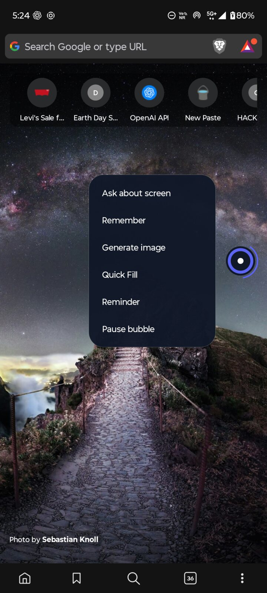
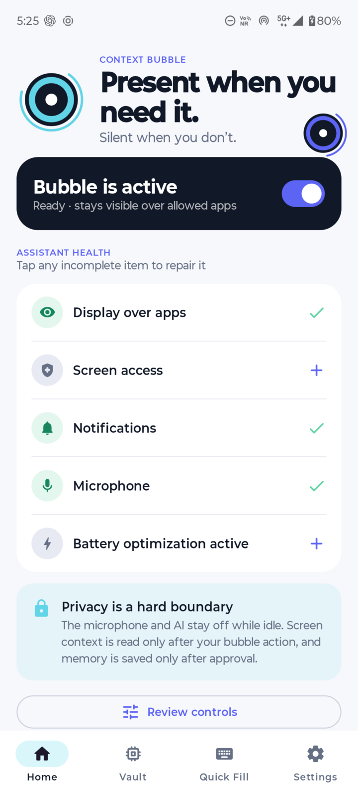
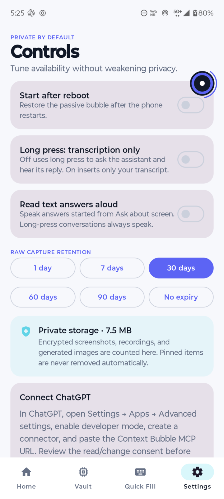
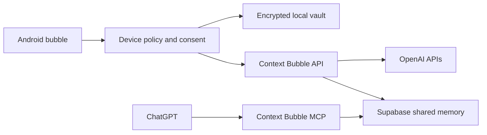

# Context Bubble

**A privacy-first Android assistant that stays beside your work instead of pulling you away from it.**

Context Bubble is a lightweight, edge-docked assistant for Android 13+. It can understand a screen only when the user asks, answer without leaving the current app, hold a Realtime voice conversation, insert polished dictation, create reminders, generate images, fill reusable details, and retain only the memories the user approves.

The idea came from a simple frustration: useful context is usually trapped inside the app where it appeared. If a message says “email me on Tuesday,” the normal workflow is to switch apps, copy details, explain the context again, and manually create a reminder. Context Bubble turns that into one intentional interaction while keeping the user in control.

## See it in action

<table>
  <tr>
    <td align="center"></td>
    <td align="center"></td>
    <td align="center"></td>
  </tr>
  <tr>
    <td align="center"><strong>Available in the current app</strong><br>Ask, remember, generate, fill, or create a reminder.</td>
    <td align="center"><strong>Permission health at a glance</strong><br>Every missing capability has a visible repair path.</td>
    <td align="center"><strong>Private by default</strong><br>Voice mode, retention, and encrypted storage stay user-controlled.</td>
  </tr>
</table>

## How it works

1. The bubble remains quietly docked to a safe screen edge over allowed applications.
2. The user taps it and chooses **Ask about screen**, **Remember**, **Generate image**, **Quick Fill**, or **Reminder**.
3. Context Bubble checks the current package and sensitive-screen policy before reading anything.
4. It captures only the context needed for that explicit request and streams the result into an overlay over the current app.
5. The user can copy, save, edit, confirm, retry, or close the result. External writes always receive an exact preview and confirmation.

A long press starts a live assistant conversation by default. An optional setting turns the same gesture into transcription-only mode, which inserts into the focused field and preserves the transcript in the clipboard if insertion fails.

## What you can do

- **Ask about the screen:** understand, summarize, translate, extract tasks, or draft a response from the current screen without switching applications.
- **Talk naturally:** use Realtime WebRTC voice with spoken replies, interruption, a short warm continuation window, and buffered transcription fallback.
- **Dictate anywhere:** insert polished speech into the focused editor with wrong-target protection, cursor preservation, paste fallback, and clipboard recovery.
- **Remember intentionally:** review or edit a structured memory candidate before saving it locally or to Shared AI memory.
- **Generate from context:** create an image from an explicitly shared screen and request, then copy, share, save, regenerate, or delete it.
- **Quick Fill safely:** insert names, email addresses, phone numbers, addresses, and custom snippets. Passwords, payment cards, PINs, and OTPs are prohibited.
- **Create reminders:** extract a title, time, timezone, recurrence, and source, then confirm a local reminder or optional Google Calendar event.
- **Keep a usable vault:** browse approved memories, transcripts, screenshots, generated images, snippets, and recent results with configurable retention.

## Memory that the user owns

Context Bubble separates data into three lanes so “using context” never silently becomes “remembering everything.”

| Lane | Purpose | Leaves the phone? |
|---|---|---|
| **Ephemeral context** | Used only for the active request, then discarded | Only the minimum request context sent to the assistant |
| **Local only** | Quick Fill, private notes, raw captures, transcripts, and vault items | No, unless explicitly shared for one action |
| **Shared AI** | User-approved facts available across Context Bubble sessions | Yes, encrypted and synchronized after sign-in |

Context Bubble also exposes its own authenticated MCP server. After the user connects it and grants access, ChatGPT can search approved Shared AI memories and prepare changes. Writes and deletes use a two-stage preview plus a ten-minute, one-use confirmation token.

This does **not** modify native ChatGPT Memory. Context Bubble remains the source of truth, and local-only data is never exposed through MCP.

## Privacy is a hard boundary

- No idle microphone, screenshot, AI request, WebRTC connection, Supabase Realtime socket, polling loop, animation loop, sensor subscription, or wake lock.
- Screen context is processed only after a bubble action; screenshots respect Android's protected-window rules.
- Financial, UPI, password-manager, authenticator, OTP, biometric, permission, installer, and system credential surfaces are hard-blocked.
- Users can search installed applications and add their own bubble exclusions, but they cannot weaken mandatory hard blocks.
- Raw screenshots and recordings never enter Supabase Database or Storage. Generated images are cloud-saved only after **Save** and are encrypted before upload.
- Screen text and stored memories are treated as untrusted data. Model output cannot directly authorize device actions.
- Local files use AES-256-GCM with Android Keystore-protected keys. Private screens are excluded from backups and app-switcher previews.
- Messages, calendar writes, uploads, edits, deletions, and other consequential actions require a precise preview and confirmation.

## What makes Context Bubble different

- **It stays in the workflow.** Answers and controls appear over the current application instead of repeatedly opening a separate assistant app.
- **It is consent-driven.** Availability is persistent; capture and long-term memory are not.
- **It has explicit memory boundaries.** Ephemeral, local-only, and shared data cannot silently collapse into one store.
- **It is Android-native.** Overlay geometry, insets, Accessibility insertion, audio routing, foreground-service recovery, clipboard fallback, and secure-screen policy are implemented at the platform level.
- **It separates public and experimental automation.** The Play build uses safe intents and user-confirmed actions; deterministic Accessibility actuators exist only in the separately identified Lab build.

## Current implementation status

| Capability | Status |
|---|---|
| Persistent overlay, in-app answer cards, Quick Fill, local vault, exclusions, and reminders | Implemented on Android |
| Screen understanding, image generation, buffered transcription, and Realtime voice | Implemented; requires the configured OpenAI backend |
| Supabase authentication, encrypted cloud memory, sync, conflict handling, and semantic retrieval | Implemented; cloud features remain optional |
| Context Bubble read/write MCP | Implemented; requires OAuth consent and a compatible ChatGPT connector |
| Google Calendar synchronization | Implemented; requires separate least-privilege Google authorization |
| Deterministic Accessibility automation | Lab APK only; compile-time excluded from Play |
| iOS system-wide bubble | Outside the current scope because iOS has no equivalent arbitrary overlay API |

## Architecture



- Native Kotlin with `minSdk 33` and `targetSdk 36`.
- Jetpack Compose for the app shell and shallow classic Android `View` overlays for the persistent bubble and response surfaces.
- Room, DataStore, Android Keystore, coroutines/Flow, Hilt, and constrained WorkManager synchronization.
- A shared Hono TypeScript implementation used by the local Node adapter and Supabase Edge Functions.
- Supabase Auth, Postgres/pgvector, private Storage, OAuth, RLS, and 384-dimensional embeddings.
- OpenAI Responses streaming, transcription, Realtime WebRTC, and image generation. Permanent credentials remain server-side.
- Separate Play and Lab application IDs with compile-time artifact-isolation checks.

## Performance and reliability

The idle path owns one small overlay view and an event-driven Accessibility listener. It does not continuously traverse view trees or keep cloud connections alive. Drag updates are frame-coalesced, overlay geometry follows live system insets, and network synchronization runs through constrained background work.

The primary development device is a Motorola moto g54 5G running Android 15. Automated suites cover gesture state, inset clamping, sensitive-package precedence, target revalidation, encryption, memory-lane isolation, sync conflicts, idempotency, MCP confirmation security, and Play/Lab isolation. See the [performance contract](docs/PERFORMANCE.md) and [validation record](docs/VALIDATION.md) for the numerical gates and current evidence.

## Build and test

Requirements: Android SDK 36, JDK 17+, and Node.js 22+.

```powershell
.\gradlew.bat testPlayDebugUnitTest testLabDebugUnitTest lintPlayDebug assemblePlayDebug assembleLabDebug

cd backend
npm install
npm run typecheck
npm test
deno task check:edge

cd ..\oauth-consent
npm install
npm run build
```

Debug APKs are written to:

- `app/build/outputs/apk/play/debug/app-play-debug.apk`
- `app/build/outputs/apk/lab/debug/app-lab-debug.apk`

Install upgrades with `adb install -r` so the Room database, permissions, and application data survive.

### Local phone testing

```powershell
$adb = "$env:LOCALAPPDATA\Android\Sdk\platform-tools\adb.exe"
& $adb reverse tcp:8787 tcp:8787

cd backend
Copy-Item .env.example .env
npm run dev
```

For AI-only local testing, configure `OPENAI_API_KEY`, `OPENAI_MODEL_PROFILE=budget`, and a strong `INSTALLATION_TOKEN_SECRET`. Cloud, MCP, Calendar, signed policy, and production Play Integrity activate only when their complete server configuration is present. See [`backend/.env.example`](backend/.env.example) for every variable.

Release builds default to the deployed development Edge API. A production or compatible custom endpoint can be supplied through `MANAGED_BACKEND_URL` or the `managedBackendUrl` Gradle property; it must use HTTPS and end in `/`.

## Deployment and deeper documentation

- [Project story](aboutproject.md)
- [Cloud deployment](docs/CLOUD_DEPLOYMENT.md)
- [Threat model](docs/THREAT_MODEL.md)
- [Performance contract](docs/PERFORMANCE.md)
- [Validation record](docs/VALIDATION.md)
- [Privacy policy draft](docs/PRIVACY.md)

Production capabilities are released behind server configuration flags so a cloud failure never disables the local bubble, Quick Fill, vault, or reminders.

## Current scope and limitations

- Android cannot restart an application after the user force-stops it, and some OEM background managers require explicit user repair.
- Protected screens and hard-blocked sensitive applications intentionally provide no screen context.
- ChatGPT accesses Shared AI memory only through the connected Context Bubble MCP; it does not continuously monitor the phone or inherit native ChatGPT Memory.
- Image clipboard support varies by target application, so Share and Save remain reliable fallbacks.
- The Play build can prepare supported actions but does not give a model unrestricted control over arbitrary taps, scrolling, credentials, purchases, or sending messages.
